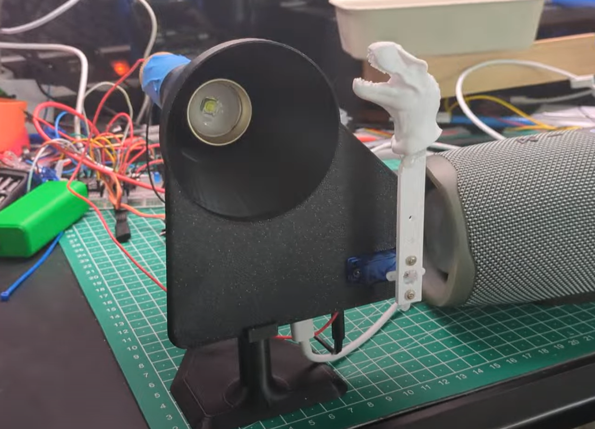
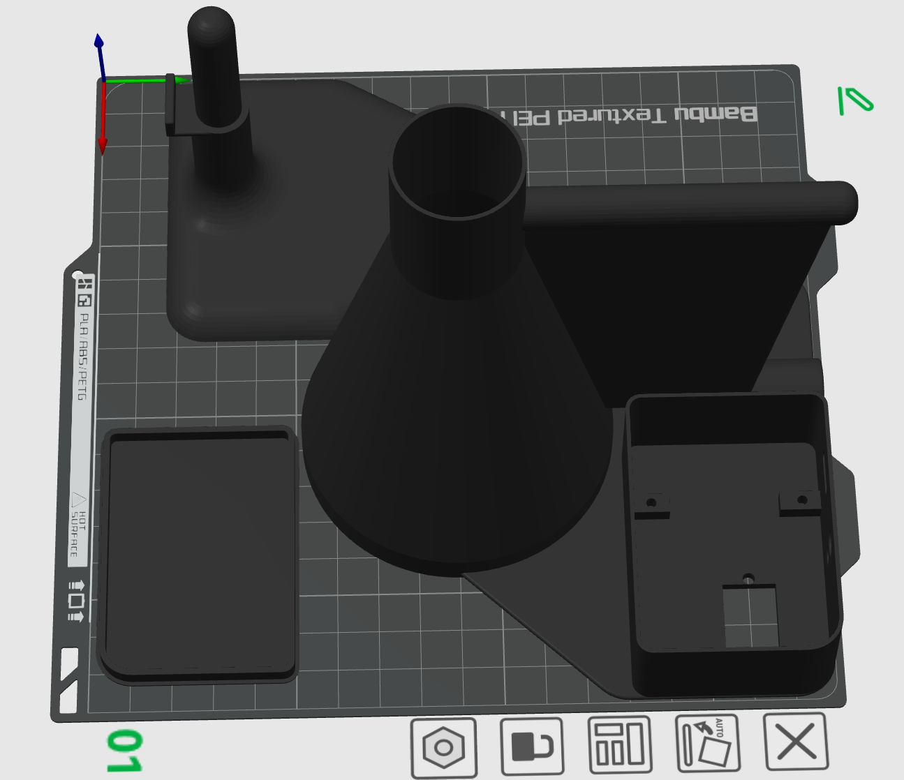
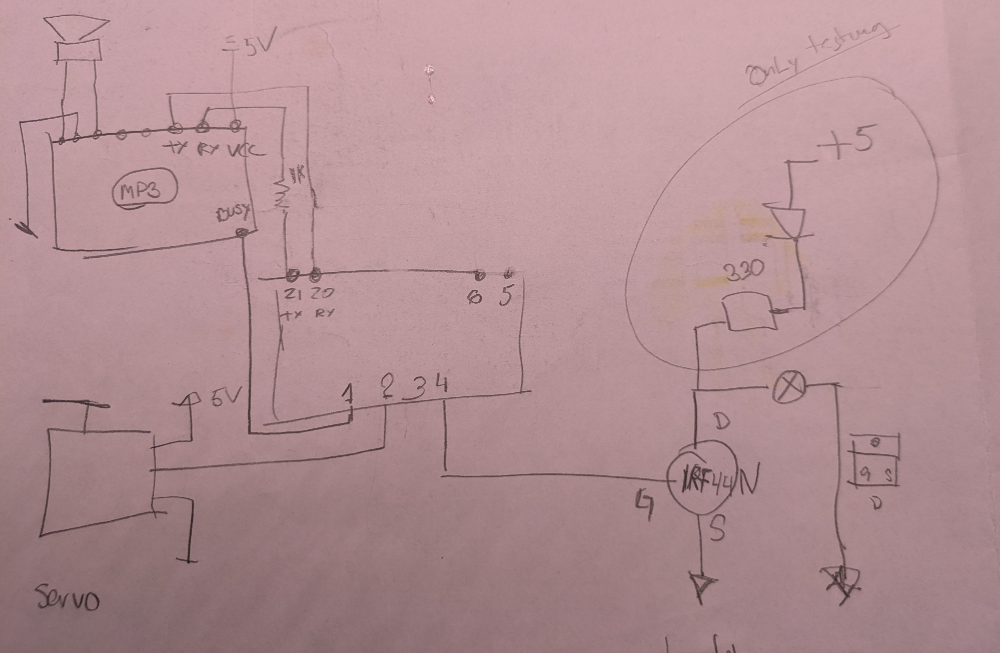

### Details on the t-Rex rig.

Artifacts:
- ESP32 Code (written using Google Gemini) - My first attempt of a fully written AI code directed by me of carse ;-) [Full Code](Full-Jurassic-park-anamatronic.ino)
- My [Test Code](../Jurasic-Park-theme/Jurasic-Park-theme.ino) for all the electronics.
-  - right now just a scan of the hand written one!
- 3D Model [3mf file](<Projector tube v17.3mf>) - Not on MakerWorld yet - Not sure if it should go there.
