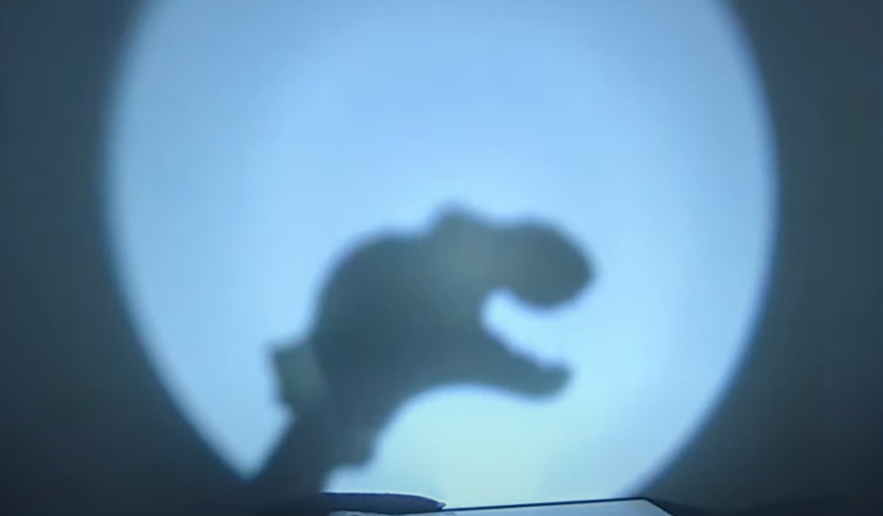
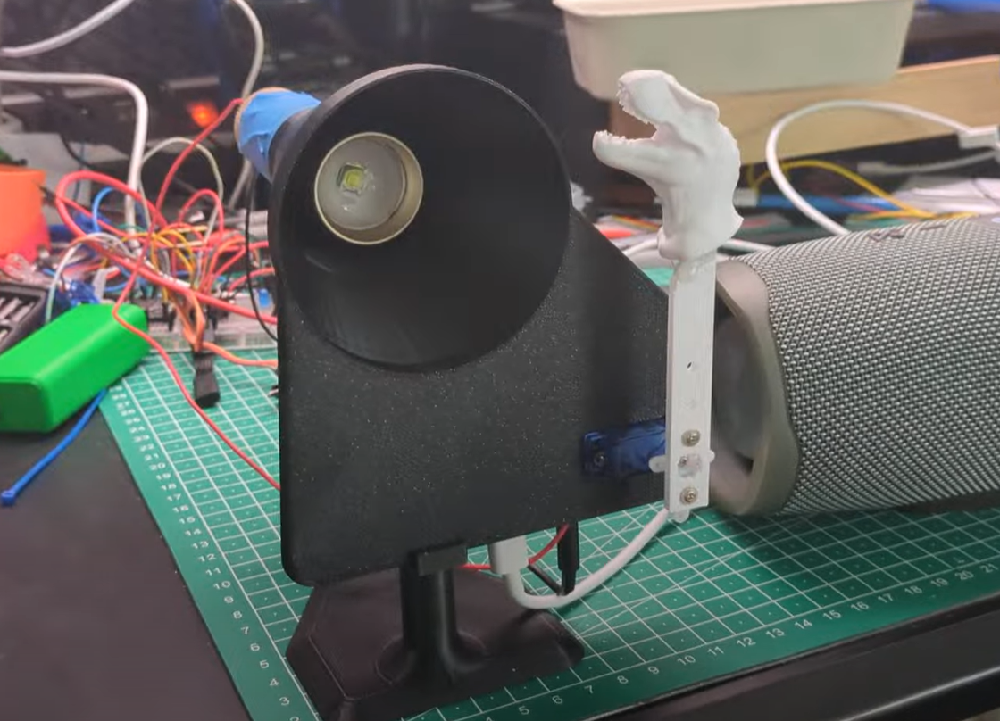
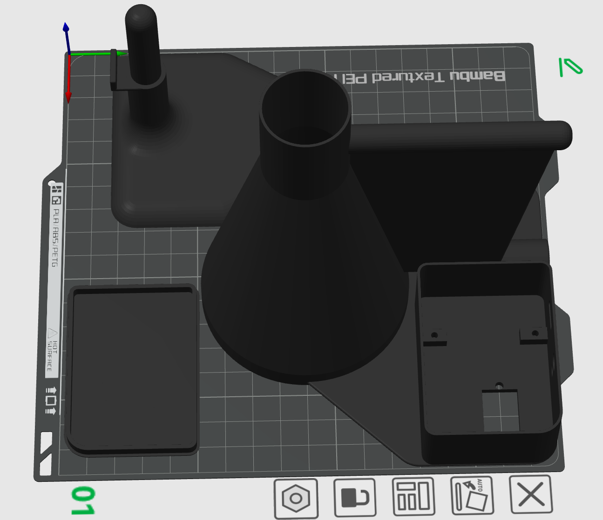

# Small Halloween projects and tests
This is for a collection of smaller light and animatronics projects for halloween, I might split more in the future, now it is just to collect my early tests and projects in one place.

They are mainly based on ESP32-C3 Supermini as it is the cheapest ESP32 I could fine here is a good reference:https://www.espboards.dev/esp32/esp32-c3-super-mini/
You can buy the many places I got them on Aliexpress https://www.aliexpress.com/.

### Table of Contents
1. [Monster eye](#Monster-eye)
2. [T-Rex in the distance](#T-Rex-in-the-distance)

## Monster eye
Early start on a Eye that will be part of a Jurassic Park Themes installation 

<video controls src="images/DragonEye.mp4" title="Title"></video>
Artifacts:
- The simple ESP32 code [Sketch](Dragon_Eye/Dragon_Eye.ino)
- 3-D Model on [Maker World](https://makerworld.com/en/models/1428108-dragon-eye-light-for-maker-s-supply-puck-light#profileId-1484523)

## T-Rex in the distance
My first ever full Animatronics A T-Rex appears in a flashlight on occasions and makes sounds when it appears - while not appearing it plays some Jurassic Park alike sounds.

It has 3 modes:
- **idle:** no flashlight and background sounds
- **Peak:** the t-rex appears in a flash for 2 seconds on a random interval between 30 and 60 seconds.
- **Walk-by:** The flashlight switches on at the t-rea slowly passes by in the light (5 seconds) on a random interval between 20 and 50 seconds.

### Details on the t-Rex rig.

Artifacts:
- ESP32 Code (written using Google Gemini) - My first attempt of a fully written AI code directed by me of carse ;-) [Full Code](Full-Jurassic-park-anamatronic/Full-Jurassic-park-anamatronic.ino)
- My [Test Code](Jurasic-Park-theme/Jurasic-Park-theme.ino) for all the electronics.
- [Schematics](images/Schematics-jurassicpark.jpg) - right now just a scan of the hand written one!
- 3D Model [3mf file](<Full-Jurassic-park-anamatronic/Projector tube v17.3mf>) - Not on MakerWorld yet - Not sure if it should go there.