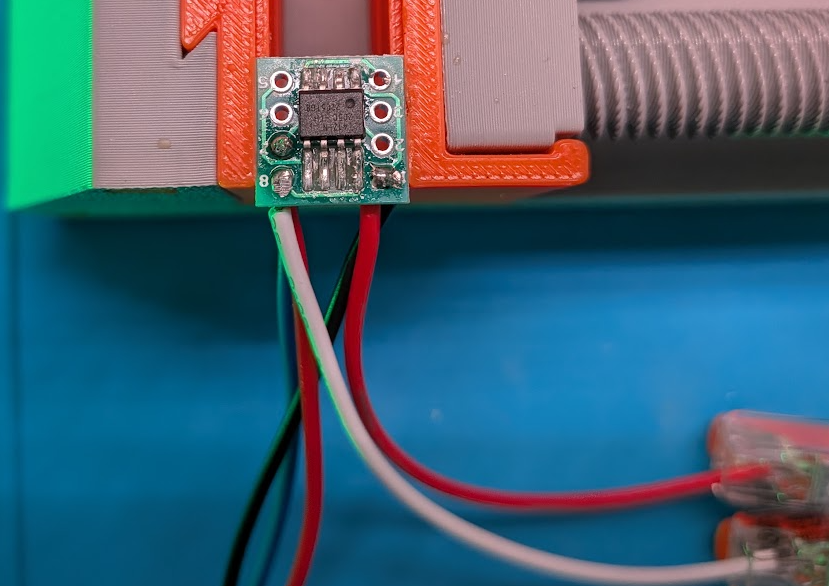
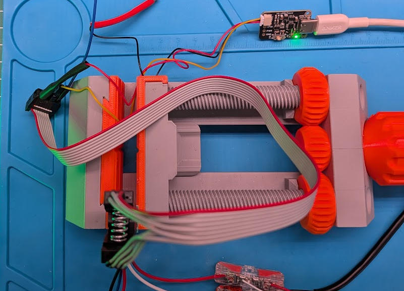

Full project. Started as a WLED project but has morphed into a ATTiny412 project to cut cost and power consumption - for AA battery usages.

 Temp picture for illustration it will be a nicer end result

 ATtiny412 WS2812B Automatic Scene Sequence
 -----------------------------------------------------------------------------
 Automatically cycles through 4 scenes:
 1. Breathe Scene: 10 seconds (10% to 100% brightness, 2s per pulse)
 2. Solid Green:   10 seconds (100% brightness)
 3. Breathe Scene: 10 seconds (10% to 100% brightness, 2s per pulse)
 4. Off (Dark):    15 seconds (Strip completely dark)

## Battery Test
This test was done with **14 LEDs** in a WWS2812B 5V LED Strip.

The whole thing is built to run on AA batteries. All tests were executed with fresh, out-of-the-pack Amazon Basic Alkaline batteries.
First test was at Maximum Voltage _ 6V  -- 4 1.5V AA batteries. It ran for over **40 hours** before the scenes were not working well, at that time, the pack voltage was 2.3 V with load and 3.1 without the eyes connected. The ATTiny can operate between 1.8 and 5.5 V, with 6 V being the absolute maximum. So the limit is probably the LED drawing more wattage and making the ATtiny unstable.
The next test was with 3 AA batteries (4.5 Volts)

- 4 AA batteries: +40hours.
- 3 AA Batteries: 

### How to extend the battery life.
Reduce the number of LEDs if used near attendees. 
Other options are more AA batteries in parallel ***DO NOT EXCEED 6V*** or to use a more powerful USB power banks; To connect the power bank, find an old USB 2 cable, strip it, and connect the 2 power lines (isolating the data line and do not short them. 

## Hardware Configuration:
 - PA3 (Pin 7): WS2812B NeoPixel Data Output
 - PA6 (Pin 2): Serial TX Debug Output (115200 baud, TX-Only) [If Enabled]

It only requires a very small ATTiny412, a short LED strip (14 leds - or less), a Battery pack and a Programming kit (for initial programming)

## Box
MakerWorld File:
Inspired by this: [thingiverse.com/thing:2589020/files ](https://www.thingiverse.com/thing:2589020), but it has been redesigned completely to have multiple eyes, cleaner eye looks, with multi material print option and to house a 3 AA Battery pack 
