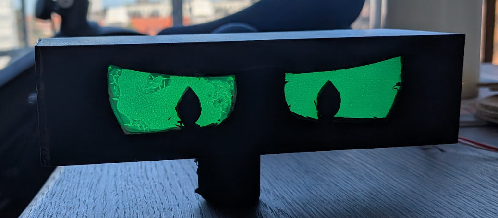

Full project. Started as a WLED project but has morphed into a ATTiny412 project to cut cost and power consumption - for AA battery usages.

 Temp picture for illustration it will be a nicer end result

 ATtiny412 WS2812B Automatic Scene Sequence
 -----------------------------------------------------------------------------
 Automatically cycles through 4 scenes:
 1. Breathe Scene: 10 seconds (10% to 100% brightness, 2s per pulse)
 2. Solid Green:   10 seconds (100% brightness)
 3. Breathe Scene: 10 seconds (10% to 100% brightness, 2s per pulse)
 4. Off (Dark):    15 seconds (Strip completely dark)

 Hardware Configuration:
 - PA3 (Pin 7): WS2812B NeoPixel Data Output
 - PA6 (Pin 2): Serial TX Debug Output (115200 baud, TX-Only) [If Enabled]

It only requires a very small ATTiny412, a short LED strip (14 leds - or less), a Battery pack and a Programming kit (for initial programming)

